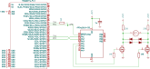

# Raspberry Pi Qaurtz Clock Driver

## Description

A Raspberry&nbsp;Pi board with an ATtiny microcontroller that drives the coil of
a quartz clock movement directly.




## Raspberry&nbsp;Pi configuration ##

Low level configuration of the Raspberry&nbsp;Pi is defined in the files
```cmdline.txt``` and ```config.txt``` which resides either in ```/boot/``` or
```/boot/firmware/``` depending on the system version.

### cmdline.txt ###
To use the ```RX1/TX1``` UART serial port on the Raspberry&nbsp;Pi the serial
console needs to be deactivated. This can be done via the ```raspi-config```
tool, or by removing the string ```console=serial0,115200``` from
```cmdline.txt```. Also see next section.

### config.txt ###
To enable UART and activate the ```RX4/TX4``` serial port on the
Raspberry&nbsp;Pi&ge;4 ```config.txt``` needs to include the following lines. 
```
[all]
enable_uart=1
dtoverlay=uart4
dtoverlay=miniuart-bt
```
The overlay for ```miniuart-bt``` seems to be necessary to make ```pymcuprog```
work with the ```RX1/TX1``` serial port. This is only strictly necessary if
flashing the attiny over this serial port.


## Installation

### Build requirements for the ATtiny firmware
```bash
apt install gcc-avr libc-avr python3-pip
pip3 install pymcuprog
```

### Build the ATtiny firmware
```bash
cd attiny-firmware
make distclean; make main.hex
```

### Flash the firmware to the ATtiny
This step requires a Raspberry&nbsp;Pi;ge;4 with the serial port RX4/TX4 on pin
21/24.

Alternativley that the Raspberry&nbsp;Pi is hooked up by jumper wires to connect
RX1/TX1 to pins 21/24 of the expansion board, as well as any GND and and 3.3V to
pin 1 of the expansion board.

```bash
# Replace /dev/ttyAMA4 with /dev/ttyAMA0 if using this serial port
pymcuprog  --device attiny1614  --tool uart  --uart /dev/ttyAMA4  ping
pymcuprog  --device attiny1614  --tool uart  --uart /dev/ttyAMA4  erase
pymcuprog  --device attiny1614  --tool uart  --uart /dev/ttyAMA4  --filename main.hex  write 
pymcuprog  --device attiny1614  --tool uart  --uart /dev/ttyAMA4  --filename main.hex  verify
pymcuprog  --device attiny1614  --tool uart  --uart /dev/ttyAMA4  reset
```

### Build and install the clock-controller debian package
```bash
cd clock-controller
make distclean; make
apt install .build/clock-controller-*.deb
```


## Usage
Start the read and send scripts. Start them in side by side tmux panes for a
smooth experience.
```bash
python3 /usr/share/clock-controller/uart_send.py /dev/serial0
python3 /usr/share/clock-controller/uart_read.py /dev/serial0
```

### UART commands

| command               | description                                                                    |
|-----------------------|--------------------------------------------------------------------------------|
|```version```          | Replies with the firmware version.                                             |
|```reset```            | Reset the microcontroller.                                                     |
|```mode:[1,16]```      | Set the run mode to 1Hz or 16Hz.                                               |
|```start```            | Start the clock. The controller sends its second count every 2s while running. |
|```stop```             | Stop the clock.                                                                |
|```period:[0..4095]``` | Set the counter wrap around (set to 3255 by the mode command).                 |
|```duty:[0..255]```    | Set the drive duty cycle (set to 15 or 127 respectively by the mode command).  |


## License

This project is licensed under the terms specified in the LICENSE file.